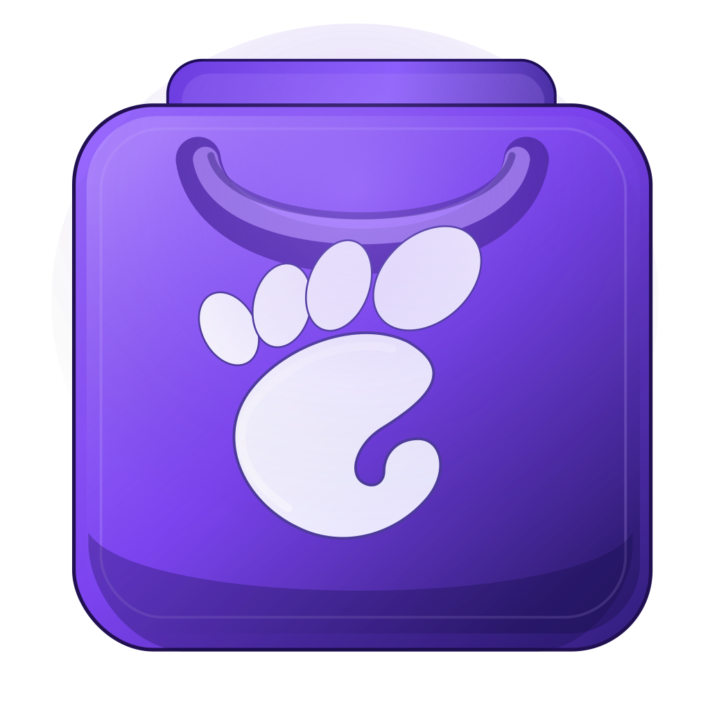

<p align="center">
  
</p>

# Gnome Power Toys

PowerToys-inspired utilities for GNOME on Wayland.

The first toy is **Text Extractor**: select an area of the screen, OCR the capture, and copy the detected text to the Wayland clipboard.

## Features

- GTK4 desktop app written in Rust.
- GNOME Wayland interactive screen capture through `xdg-desktop-portal`.
- OCR through `tesseract`.
- Clipboard integration through `wl-copy`.
- Compact launcher-style UI with a tool sidebar.
- Text Extractor hides the app during capture and brings it back when OCR finishes.
- Copy button and `Ctrl+C` reuse the last extracted text.
- Local install through `make install`.
- Built to grow into more GNOME/Linux tools later.

## Install

Fedora dependencies:

```sh
sudo dnf install gtk4-devel xdg-desktop-portal xdg-desktop-portal-gnome tesseract tesseract-langpack-por tesseract-langpack-eng wl-clipboard
```

Ubuntu/Debian dependencies:

```sh
sudo apt install libgtk-4-dev xdg-desktop-portal xdg-desktop-portal-gnome tesseract-ocr tesseract-ocr-por tesseract-ocr-eng wl-clipboard
```

Build and install locally:

```sh
make install
```

This installs:

```text
~/.local/bin/gnome-power-toys
~/.local/share/applications/dev.gutopardini.GnomePowerToys.desktop
~/.local/share/metainfo/dev.gutopardini.GnomePowerToys.metainfo.xml
~/.local/share/icons/hicolor/scalable/apps/dev.gutopardini.GnomePowerToys.svg
```

If GNOME does not show the launcher immediately, log out and back in or run:

```sh
gtk-update-icon-cache ~/.local/share/icons/hicolor
update-desktop-database ~/.local/share/applications
```

## Usage

Run from source:

```sh
cargo run
```

Or start the installed launcher:

```sh
gnome-power-toys
```

Choose a language mode, click **Extract text**, make a capture, and the result appears in the app. Use the copy icon or `Ctrl+C` to copy the latest text again.

## Build

Build release:

```sh
cargo build --release --locked
```

Validate formatting and tests:

```sh
cargo fmt -- --check
cargo test
```

## Notes

This project intentionally targets GNOME on Wayland. Screen capture is routed through the desktop portal instead of X11 APIs, GNOME Shell private APIs, or compositor-specific tools such as `grim` and `slurp`.

## Support

<a href="https://www.buymeacoffee.com/gutopardini" target="_blank">
  
</a>
